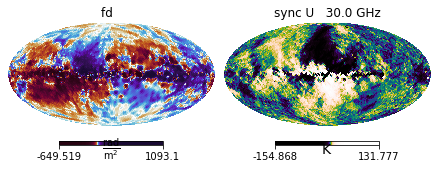

.. _IMAGINE Components:

==================
IMAGINE Components
==================

In the following sections we describe each of the basic components of IMAGINE.
We also demonstrate how to write wrappers that allow the inclusion of external
(pre-existing) code, and provide code templates for this.

.. contents:: Contents
   :local:

.. _Fields:

------
Fields
------

In IMAGINE terminology, a **field** refers to any  *computational model* of a
spatially varying physical quantity, such as the Galactic Magnetic Field (GMF),
the thermal electron distribution, or the Cosmic Ray (CR) distribution.
Generally, a field object will have a set of parameters — e.g. a GMF field
object may have a pitch angle, scale radius, amplitude, etc.
*Field* objects are used as inputs by the `Simulators`_, which *simulate*
those physical models, i.e. they allow constructing *observables*
based on a set models.

During the sampling, the `Pipeline`_ does not handle fields directly  but
instead relies on `Field Factory`_ objects.
While the *field objects* will do the actual computation of the physical field,
given a set of physical parameters and a coordinate grid,
the *field factory objects* take care of book-keeping tasks: they hold the
parameter ranges, default values (in case of inactive parameters) and
`Priors`_ associated with each parameter of that *field*.

To convert ones own model into a IMAGINE-compatible field, one must create a
subclass of one of the base classes available the
:py:mod:`imagine.fields.base_fields`, most likely using one of the available
templates (discussed in the
sections below) to write a *wrapper* to the original code.
If the basic field type one is interested in
is *not* available as a basic field, one
can create it directly subclassing
:py:class:`imagine.fields.field.Field` —
and if this could benefit the wider community, please consider
submitting a
`pull request <https://github.com/IMAGINE-Consortium/imagine/pulls>`_ or
openning an `issue <https://github.com/IMAGINE-Consortium/imagine/issues>`_
requesting the inclusion of the new field type!

It is assumed that **Field** objects can be expressed as a parametrised *mapping of
a coordinate grid into a physical field*. The grid is represented by a IMAGINE
:ref:`Grid` object, discussed in detail in the next section.
If the field is of random or **stochastic** nature (e.g. the density field of
a turbulent medium), IMAGINE will compute a *finite ensemble* of different
realisations which will later be used in the inference to determine the likelihood
of the actual observation, accounting for the model's expected variability.

To test a Field class, :py:class:`FieldFoo`, one can
instantiate the field object::

    bar = FieldFoo(grid=example_grid, parameters={'answer': 42*u.cm}, ensemble_size=2)

where :py:obj:`example_grid` is a previously instantiated grid object. The argument
:py:data:`parameters` receives a dictionary of all the parameters used by
:py:obj:`FieldFoo`, these are usually expressed as dimensional quantities
(using :py:mod:`astropy.units`).
Finally, the argument :py:data:`ensemble_size`, as the name suggests allows
requestion a number of different realisations of the field (for non-stochastic
fields, all these will be references to the same data).

To further illustrate, assuming we are dealing with a scalar,
the (spherical) radial dependence of the above defined :py:obj:`bar`
can be easily plotted using::

    import matplotlib.pyplot as plt
    bar_data = bar.get_data(ensemble_index)
    plt.plot(bar.grid.r_spherical.ravel(), bar_data.ravel())

The design of any field is done writing a *subclass* of one of the classes in
:py:mod:`imagine.fields.base_fields` or
:py:class:`imagine.Field <imagine.fields.field.Field>`
that overrides the method
:py:meth:`compute_field(seed) <imagine.fields.field.Field.compute_field>`,
using it to compute the field on each spatial point.
For this, the coordinate grid on which the field should
be evaluated can be accessed from
:py:data:`self.grid <imagine.fields.field.Field.grid>`
and the parameters from
:py:data:`self.parameters <imagine.fields.field.Field.parameters>`.
The same parameters must be listed in the :py:data:`PARAMETER_NAMES` field class
attribute (see the templates below for examples).

.. _Grid:

^^^^
Grid
^^^^

Field objects require (with the exception of `Dummy`_ fields) a coordinate grid
to operate.
In IMAGINE this is expressed as an instance of the
:py:class:`imagine.fields.grid.BaseGrid` class, which represents coordinates as
a set of three 3-dimensional arrays.
The grid object supports cartesian, cylindrical and spherical coordinate systems,
handling any conversions between these automatically through the properties.

The convention is that :math:`0` of the coordinates corresponds to the
Galaxy (or galaxy) centre, with the :math:`z` coordinate giving the distance to
the midplane.

To construct a grid with uniformly-distributed coordinates one can use the
:py:class:`imagine.fields.UniformGrid <imagine.fields.grid.UniformGrid>`
that accompanies IMAGINE.
For example, one can create a grid where the cylindrical coordinates are equally
spaced using::

    from imagine.fields import UniformGrid
    cylindrical_grid = UniformGrid(box=[[0.25*u.kpc, 15*u.kpc],
                                        [-180*u.deg, np.pi*u.rad],
                                        [-15*u.kpc, 15*u.kpc]],
                                   resolution = [9,12,9],
                                   grid_type = 'cylindrical')

The :py:data:`box` argument contains the lower and upper limits of the
coordinates (respectively :math:`r`, :math:`\phi` and :math:`z`),
:py:data:`resolution` specifies the number of points for each dimension, and
:py:data:`grid_type` chooses this to be cylindrical coordinates.

The coordinate grid can be accessed through the properties
:py:data:`cylindrical_grid.x`,
:py:data:`cylindrical_grid.y`,
:py:data:`cylindrical_grid.z`,
:py:data:`cylindrical_grid.r_cylindrical`,
:py:data:`cylindrical_grid.r_spherical`,
:py:data:`cylindrical_grid.theta` (polar angle), and
:py:data:`cylindrical_grid.phi` (azimuthal angle),
with conversions handled automatically.
Thus, if one wants to access, for instance, the corresponding :math:`x`
cartesian coordinate values, this can be done simply using::

    cylindrical_grid.x[:,:,:]

To create a personalised (non-uniform) grid, one needs to subclass
:py:class:`imagine.fields.grid.BaseGrid` and override the method :py:meth:`generate_coordinates <imagine.fields.grid.BaseGrid.generate_coordinates>`.
The :py:class:`UniformGrid <imagine.fields.grid.UniformGrid>`
class should itself provide a good example/template of how to do this.

^^^^^^^^^^^^^^^^^
Thermal electrons
^^^^^^^^^^^^^^^^^

A new model for the distribution of thermal electrons can be introduced
subclassing :py:class:`imagine.fields.ThermalElectronDensityField <imagine.fields.base_fields.ThermalElectronDensityField>`
according to the template below.

.. literalinclude:: ../../imagine/templates/thermal_electrons_template.py

Note that the return value of the method :py:meth:`compute_field() <imagine.fields.field.Field.compute_field>` must be of type
:py:class:`astropy.units.Quantity`, with shape consistent with the coordinate
grid, and units of :math:`\rm cm^{-3}`.

The template assumes that one already possesses a model for distribution of
thermal :math:`e^-` in a module :py:mod:`MY_GALAXY_MODEL`. Such model needs to
be able to map an arbitrary coordinate grid into densities.

Of course, one can also write ones model (if it is simple enough) into the
derived subclass definition. On example of a class derived from
:py:class:`imagine.fields.ThermalElectronDensityField <imagine.fields.base_fields.ThermalElectronDensityField>` can be seen
bellow::

    from imagine.fields import ThermalElectronDensityField

    class ExponentialThermalElectrons(ThermalElectronDensityField):
        """Example: thermal electron density of an (double) exponential disc"""

        NAME = 'exponential_disc_thermal_electrons'
        PARAMETER_NAMES = ['central_density',
                           'scale_radius',
                           'scale_height']

        def compute_field(self, seed):
            R = self.grid.r_cylindrical
            z = self.grid.z
            Re = self.parameters['scale_radius']
            he = self.parameters['scale_height']
            n0 = self.parameters['central_density']

            return n0*np.exp(-R/Re)*np.exp(-np.abs(z/he))

^^^^^^^^^^^^^^^
Magnetic Fields
^^^^^^^^^^^^^^^

One can add a new model for magnetic fields subclassing
:py:class:`imagine.fields.MagneticField <imagine.fields.base_fields.MagneticField>`
as illustrated in the template below.

.. literalinclude:: ../../imagine/templates/magnetic_field_template.py

It was assumed the existence of a hypothetical module :py:mod:`MY_GALAXY_MODEL`
which, given a set of parameters and three 3-arrays containing coordinate values,
computes the magnetic field vector at each point.

The method :py:meth:`compute_field() <imagine.fields.field.Field.compute_field>`
must return an :py:class:`astropy.units.Quantity`,
with shape `(Nx,Ny,Nz,3)` where `Ni` is the corresponding grid resolution and
the last axis corresponds to the component (with x, y and z associated with
indices 0, 1 and 2, respectively). The Quantity returned by the method must
correpond to a magnetic field (i.e. units must be :math:`\mu\rm G`, :math:`\rm G`,
:math:`\rm nT`, or similar).

A simple example, comprising a constant magnetic field can be seen below::

    from imagine.fields import MagneticField

    class ConstantMagneticField(MagneticField):
        """Example: constant magnetic field"""
        field_name = 'constantB'

        NAME = 'constant_B'
        PARAMETER_NAMES = ['Bx', 'By', 'Bz']

        def compute_field(self, seed):
            # Creates an empty array to store the result
            B = np.empty(self.data_shape) * self.parameters['Bx'].unit
            # For a magnetic field, the output must be of shape:
            # (Nx,Ny,Nz,Nc) where Nc is the index of the component.
            # Computes Bx
            B[:, :, :, 0] = self.parameters['Bx']
            # Computes By
            B[:, :, :, 1] = self.parameters['By']
            # Computes Bz
            B[:, :, :, 2] = self.parameters['Bz']
            return B

^^^^^^^^^^^^^^^^^^^^
Cosmic ray electrons
^^^^^^^^^^^^^^^^^^^^

*Under development*

.. .. literalinclude:: ../../imagine/templates/cre_density_template.py

^^^^^
Dummy
^^^^^

There are situations when one may want to sample parameters which are not
used to evaluate a field on a grid before being sent to a Simulator object.
One possible use for this is representing a global property of the physical
system which affects the observations (for instance, some global property of
the ISM or, if modelling an external galaxy, the position of the galaxy).

Another common use of dummy fields is when a field is generated at runtime
*by the simulator*. One example are the built-in fields available in
Hammurabi: instead of requesting IMAGINE to produce one of these fields and
hand it to
Hammurabi to compute the associated synchrotron observables, one can use dummy
fields to request Hammurabi to generate these fields internally for a given
choice of parameters.

Using dummy fields to bypass the design of a full IMAGINE Field may simplify
implementation of a Simulator wrapper and (sometimes) may be offer good
performance. However, this practice of generating the actual field within the
Simulator *breaks the modularity of IMAGINE*, and it becomes impossible to
check the validity of the results plugging the same field on a different
Simulator. Thus, use this with care!

A dummy field can be implemented by subclassing
:py:class:`imagine.fields.DummyField <imagine.fields.base_fields.DummyField>` as shown bellow.

.. literalinclude:: ../../imagine/templates/dummy_field_template.py

Dummy fields are generally Simulator-specific and the properties
:py:data:`field_checklist` and :py:data:`simulator_controllist` are
convenient ways of sending extra settings information to the associated
Simulator. The values in :py:data:`field_checklist` allow transmitting settings
associated with specific parameters, while the dictionary
:py:data:`simulator_controllist` can be used to tell how the presence of the
the current dummy field should modify the Simulator's global settings.

For example, in the case of Hammurabi, a dummy field can be used
to request one of its built-in fields, which has to be set up by modifying
Hammurabi's XML parameter files.
In this particular case, :py:data:`field_checklist` is used to supply the
position of a parameter in the XML file, while :py:data:`simulator_controllist`
indicates how to modify the switch in the XML file that enables this specific
built-in field (see the :doc:`tutorial_hammurabi` tutorial for details).

.. _Field Factory:

---------------
Field Factories
---------------

Field Factories, represented in IMAGINE by a
:py:obj:`imagine.fields.field_factory.FieldFactory` object
are an additional layer of infrastructure used by the samplers
to provide the connection between the sampling of points in the likelihood space
and the field object that will be given to the simulator.

A *Field Factory* object has a list of all of the field's parameters and a
list of the subset of those that are to be varied in the sampler
— the latter are called the **active parameters**.
The Field Factory also holds the allowed value ranges for each parameter,
the default values (which are used for inactive parameters) and the prior
distribution associated with each (active) parameter.

At each step the
`Pipeline`_ request the Field Factory for the next point in parameter space,
and the Factory supplies it the form of a Field object constructed with that
particular choice of parameters. This can then be handed by the Pipeline to
the Simulator, which computes simulated Observables for comparison
with the measured observables in the Likelihood module.

Given a Field `YourFieldClass` (which must be an instance of a class derived
from :py:class:`Field <imagine.fields.field.Field>`), one can easily construct
a `FieldFactory` object following::

    from imagine import FieldFactory
    my_factory = FieldFactory(field_class=YourFieldClass,
                              grid=your_grid,
                              active_parameters=['param_1_active'],
                              default_parameters = {'param_2_inactive': value_2,
                                                    'param_3_inactive': value_3},
                              priors={'param_1_active': YourPriorChoice})

The object `YourPriorChoice` must be an instance of
:py:class:`imagine.priors.Prior <imagine.priors.prior.Prior>`
(see section `Priors`_ for details).
A flat prior (i.e. a uniform distribution, where all parameter values are
equally likely) can be set using the
:py:class:`imagine.priors.FlatPrior <imagine.priors.basic_priors.FlatPrior>`
class.

Since re-using a FieldFactory associated with a given Field is not uncommon,
it is sometimes convenient to create a specialized subclass for a particular
field, where the typical/recommended choices of parameters and priors are
saved.
This can be done following the template below:

.. literalinclude:: ../../imagine/templates/field_factory_template.py

One can initialize this specialized FieldFactory subclass by supplying the
grid on which the corresponding Field will be evaluated::

      myFactory = FieldFactoryTemplate(grid=cartesian_grid)

The standard values defined in the subclass can be adjusted in the instance
using the attributes :py:data:`myFactory.active_parameters`,
:py:data:`myFactory.priors` and :py:data:`myFactory.default_parameters`
(note that the latter are dictionaries, but the attribution `=` is modified so
that it *updates* the corresponding internal dictionaries instead of replacing
them).

The factory object :py:obj:`myFactory` can now be handled to the `Pipeline`_,
which will generate new fields by *calling* the :py:meth:`myFactory() <imagine.fields.field_factory.FieldFactory.__call__>`
object.

.. _Datasets:

--------
Datasets
--------

:py:class:`Dataset <imagine.observables.dataset.Dataset>` objects are helpers
used for the inclusion of observational data in IMAGINE.
They convert the measured data and uncertainties to a standard format which
can be later handed to an
:ref:`observable dictionary <ObservableDictionaries>`.
There are two main types of datasets: `Tabular datasets`_ and
`HEALPix datasets`_.

.. _imagine_datasets:

^^^^^^^^^^^^^^^^^^^
Repository datasets
^^^^^^^^^^^^^^^^^^^

A number of ready-to-use datasets are available at the community
maintained `imagine-datasets <https://github.com/IMAGINE-Consortium/imagine-datasets>`_
repository.

To be able to use this, it is necessary to install the `imagine_datasets`
extension package (note that this comes already installed if you are using
the :ref:`docker <DockerInstallation>` image). This can be done executing
the following command::

    conda activate imagine  # if using conda
    pip install git+https://github.com/IMAGINE-Consortium/imagine-datasets.git

Below the usage of an imported dataset is illustrated::

    import imagine as img
    import imagine_datasets as img_data

    # Loads the datasets (will download the datasets!)
    dset_fd = img_data.HEALPix.fd.Oppermann2012(Nside=32)
    dset_sync = img_data.HEALPix.sync.Planck2018_Commander_U(Nside=32)

    # Initialises ObservableDict objects
    measurements = img.observables.Measurements(dset_fd, dset_sync)

    # Shows the contents
    measurements.show()

.. _observable_names:

^^^^^^^^^^^^^^^^
Observable names
^^^^^^^^^^^^^^^^

Each type of observable has an agreed/conventional name.
The presently available **observable names** are:

Observable names
    * 'fd' - Faraday depth
    * 'dm' - Dispersion measure
    * 'sync' - Synchrotron emission

        * with tag 'I' - Total intensity
        * with tag 'Q' - Stokes Q
        * with tag 'U' - Stokes U
        * with tag 'PI' - polarisation intensity
        * with tag 'PA' - polarisation angle

.. _Tabular datasets:

^^^^^^^^^^^^^^^^
Tabular datasets
^^^^^^^^^^^^^^^^

As the name indicates, in **tabular datasets** the observational data was
originally
in tabular format, i.e. a table where each row corresponds to a different
*position in the sky* and columns contain (at least) the sky coordinates,
the measurement and the associated error. A final requirement is that the
dataset is stored in a *dictionary-like* object i.e. the columns can be
selected by column name (for example, a Python dictionary, a Pandas DataFrame,
or an astropy Table).

To construct a tabular dataset, one needs to initialize
:py:class:`imagine.observables.TabularDataset <imagine.observables.dataset.TabularDataset>`.
Below, a simple example of this, which fetches (using the package astroquery)
a catalog from ViZieR and stores in in an IMAGINE tabular dataset object::

    from astroquery.vizier import Vizier
    from imagine.observables import TabularDataset

    # Fetches the catalogue
    catalog = Vizier.get_catalogs('J/ApJ/714/1170')[0]

    # Loads it to the TabularDataset (the catalogue obj actually contains units)
    RM_Mao2010 = TabularDataset(catalog, name='fd', units=catalog['RM'].unit,
                                data_col='RM', err_col='e_RM', tag=None,
                                lat_col='GLAT', lon_col='GLON')

From this point the object :py:obj:`RM_Mao2010` can be appended to a
:py:obj:`Measurements <imagine.observables.observable_dict.Measurements>`.
We refer the reader to the
the :doc:`tutorial_datasets` tutorial
and the
:py:class:`TabularDataset <imagine.observables.dataset.TabularDataset>` api
documentation and for further details.

.. _HEALPix datasets:

^^^^^^^^^^^^^^^^
HEALPix datasets
^^^^^^^^^^^^^^^^

**HEALPix datasets** will generally comprise maps of the full-sky, where
`HEALPix <https://healpix.sourceforge.io/>`_ pixelation is employed.
For standard observables, the datasets can be initialized by simply supplying
a :py:obj:`Quantity <astropy.units.Quantity>` array containing the data to the
corresponding class. Below some examples, employing
the classes
:py:class:`FaradayDepthHEALPixDataset <imagine.observables.dataset.FaradayDepthHEALPixDataset>`,
:py:class:`DispersionMeasureHEALPixDataset <imagine.observables.dataset.DispersionMeasureHEALPixDataset>` and
:py:class:`SynchrotronHEALPixDataset <imagine.observables.dataset.SynchrotronHEALPixDataset>`,
respectively::

    from imagine.observables import FaradayDepthHEALPixDataset
    from imagine.observables import DispersionMeasureHEALPixDataset
    from imagine.observables import SynchrotronHEALPixDataset

    my_FD_dset = FaradayDepthHEALPixDataset(data=fd_data_array,
                                            error=fd_data_array_error)

    my_DM_dset = DispersionMeasureHEALPixDataset(data=fd_data_array,
                                                 cov=fd_data_array_covariance)

    sync_dset = SynchrotronHEALPixDataset(data=stoke_Q_data,
                                          error=stoke_Q_data_error
                                          frequency=23*u.GHz, type='Q')

In the first and third examples, it was assumed that the
*covariance was diagonal*,
and therefore can be described by an error associated with each pixel, which
is specified with the keyword argument `error` (the error is assumed to
correspond to the square root of the variance in each datapoint).

In the second example,
the covariance associated with the data is instead specified supplying a
two-dimensional array using the the `cov` keyword argument.

The final example also requires the user to supply the frequency of the
observation and the subtype (in this case, 'Q').

.. _Observables:

.. _ObservableDictionaries:

---------------------------------------
Observables and observable dictionaries
---------------------------------------

In IMAGINE, observable quantities (either measured or simulated) are
represented internally by instances of the
:py:class:`imagine.observables.Observable <imagine.observables.observable.Observable>`
class. These are grouped in *observable dictionaries* (subclasses of
:py:class:`imagine.observables.ObservableDict <imagine.observables.observable_dict.ObservableDict>`)
which are used to exchange multiple observables between IMAGINE's components.
There three main kinds of observable dictionaries: :ref:`Measurements`,
:ref:`Simulations`, and :ref:`Covariances`.
There is also an auxiliary observable dictionary: the :ref:`Masks`.

.. _Measurements:

^^^^^^^^^^^^
Measurements
^^^^^^^^^^^^

The
:py:class:`imagine.observables.Measurements <imagine.observables.observable_dict.Measurements>`
object is used, as the name implies, to hold a set of actual measured physical
datasets (e.g. a set of intensity maps of the sky at different wavelengths).

A :py:class:`Measurements <imagine.observables.observable_dict.Measurements>`
object must be provided to initialize :ref:`Simulators` (allowing them to know
which datasets need to be computed) and :ref:`Likelihoods <Likelihood>`.

There are a number of ways data can be provided to
:py:class:`Measurements <imagine.observables.observable_dict.Measurements>`.
The simplest case is when the data is stored in a :py:obj:`Datasets <imagine.observables.dataset.Dataset>` objects, one can provide them to the
measurements object upon initialization::

  measurements = img.observables.Measurements(dset1, dset2, dset3)

One can also append a dateset to a already initialized :py:obj:`Measurements <imagine.observables.observable_dict.Measurements>` object::

  measurements.append(dataset=dset4)

The final (not usually recommended) option  is appending the data manually to
the `ObservableDict`, which can be done in the following way::

  measurements.append(name=key, data=data,
                      cov_data=cov, otype='HEALPix')

In this, :py:data:`data` should contain a :py:obj:`ndarray <numpy.ndarray>`
or :py:obj:`Quantity <astropy.units.Quantity>`, :py:data:`cov_data` should
contain the covariance matrix, and :py:data:`otype` must indicate whether
the data corresponds to: a 'HEALPix' map; 'tabular'; or a 'plain' array.

The :py:data:`name` argument refers to the key that will be used to hash the
elements in the dictionary. This has to have the following form::

  key = (data_name, data_freq, Nside_or_str, tag)

* The first value should be the one of the :ref:`observable names <observable_names>`

* If data is independent from frequency, :py:data:`data_freq` is set to
  :py:data:`None`, otherwise it is the frequency in GHz.

* The third value in the key-tuple should contain the HEALPix Nside (for maps)
  or the string ‘tab’ for tabular data.

* Finally, the last value, ext can be 'I', 'Q', 'U', 'PI', 'PA',
  :py:data:`None` or other customized tags depending on the nature of the
  observable.

The contents of a
:py:class:`Measurements <imagine.observables.observable_dict.Measurements>`
object can be accessed as a dictionary, using the keys with the above
structure::

  observable = measurements[('sync', 30, 32, 'I')]

Assuming that this key is present, the :py:data:`observable` object returned
by the above line will be an instance of the
:py:class:`Observable <imagine.observables.observable.Observable>`
class. The data contents and properties can be then accessed using its
properties/attributes, for example::

  data_array = observable.global_data
  data_units = observable.unit

Where the :py:data:`data_array` will be a (1, N)-array.

:py:class:`Measurements <imagine.observables.observable_dict.Measurements>`,
support the :py:meth:`show <imagine.observables.observable_dict.ObservableDict.show>`
method (exemplified in :ref:`imagine_datasets`) which displays a summary of
the data in the
:py:obj:`ObservableDict <imagine.observables.observable_dict.ObservableDict>`.

.. _Simulations:

^^^^^^^^^^^
Simulations
^^^^^^^^^^^

The :py:obj:`Simulations <imagine.observables.observable_dict.Simulations>`
object is the
:py:class:`ObservableDict <imagine.observables.observable_dict.ObservableDict>`
that is returned when one runs an IMAGINE :ref:`Simulator <Simulators>`.

In the case of a
:py:class:`Simulations <imagine.observables.observable_dict.Simulations>` object, :py:data:`max_realizations` keyword argument can be used to limit the
number of ensemble realisations that are shown (one realisation per line).

.. _Covariances:

^^^^^^^^^^^
Covariances
^^^^^^^^^^^

:py:class:`imagine.observables.Covariances <imagine.observables.observable_dict.Covariances>`

.. _Masks:

^^^^^
Masks
^^^^^

:py:class:`imagine.observables.Masks <imagine.observables.observable_dict.Masks>`

.. _Simulators:

----------
Simulators
----------

Simulators are reponsible for mapping a set of :ref:`Fields` onto a set of
:ref:`Observables <Observables>`. They are represented by a subclass of
:py:class:`imagine.simulators.Simulator <imagine.simulators.simulator.Simulator>`.

.. literalinclude:: ../../imagine/templates/simulator_template.py

^^^^^^^^^^^^^^^^^^^
Hammurabi simulator
^^^^^^^^^^^^^^^^^^^

.. _Likelihood:

-----------
Likelihoods
-----------

Likelihoods define how to quantitatively compare the simulated and measured
observables.  They are represented within IMAGINE by an instance of class
derived from
:py:class:`imagine.likelihoods.Likelihood <imagine.likelihoods.likelihood.Likelihood>`.
There are two pre-implemented subclasses within IMAGINE:

 * :py:class:`imagine.likelihoods.SimpleLikelihood <imagine.likelihoods.simple_likelihood.SimpleLikelihood>`:
   this is the traditional method, which is like a :math:`\chi^2` based on the
   covariance matrix of the measurements (i.e., noise).
 * :py:class:`imagine.likelihoods.EnsembleLikelihood <imagine.likelihoods.ensemble_likelihood.EnsembleLikelihood>`:
   combines covariance matrices from measurements with the expected galactic
   variance from models that include a stochastic component.

Likelihoods need to be initialized before running the pipeline, and require measurements (at the front end).  In most cases, data sets will not have covariance matrices but only noise values, in which case the covariance matrix is only the diagonal.

::

  from imagine.likelihoods import EnsembleLikelihood
  likelihood = EnsembleLikelihood(data, covariance_matrix)

The optional input argument :py:obj:`covariance_matrix` does not have to contain covariance matrices corresponding to all entries in input data.  The Likelihood automatically defines the proper way for the various cases.

If the
:py:class:`EnsembleLikelihood <imagine.likelihoods.ensemble_likelihood.EnsembleLikelihood>`
is used, then the sampler will be run multiple times at each point in likelihood space to create an ensemble of simulated observables.

.. .. math::
..
.. 	\mathcal{L}(d|{c}) = -\frac{1}{2} (d-\bar{c})^\dagger (A+C)^{-1} (d-\bar{c}) - \frac{1}{2}\ln\left(\left|A+C\right|\right)

.. _Priors:

------
Priors
------

A powerful aspect of a fully Baysean analysis approach is the possibility of
explicitly stating any prior expectations about the parameter values based on
previous knowledge. A prior is represented by an instance of
:py:class:`imagine.priors.prior.GeneralPrior` or one of its subclasses.

To use a prior, one has to initialize it and include it in the associated
:ref:`Field Factory`. The simplest choice is a :py:class:`FlatPrior <imagine.priors.basic_priors.FlatPrior>`
(i.e. any parameter within the range are equally likely before the looking at
the observational data), which can be initialized in the following way::

  from imagine.priors import FlatPrior
  import astropy.units as u
  myFlatPrior = FlatPrior(interval=[-2,10]*u.pc)

where the range for this parameter was chosen to be between :math:`-2` and
:math:`10\rm pc`.

After the flat prior, a common choice is that the parameter values are
characterized by a Gaussian distribution around some central value.
This can be achieved using the
:py:class:`imagine.priors.basic_priors.GaussianPrior` class. As an example,
let us suppose one has a parameter which characterizes the strength of a
component of the magnetic field, and that ones prior expectation is that this
should be gaussian distributed with mean :math:`1\mu\rm G` and standard
deviation :math:`5\mu\rm G`. Moreover, let us assumed that the model only works
within the range :math:`[-30\mu \rm G, 30\mu G]`. A prior consistent with these
requirements can be achieved using::

  from imagine.priors import GaussianPrior
  import astropy.units as u
  myGaussianPrior = GaussianPrior(mu=1*u.microgauss, sigma=5*u.microgauss,
                                  interval=[-30*u.microgauss,30*u.microgauss])

.. _Pipeline:

--------
Pipeline
--------

The final building block of an IMAGINE pipeline is the **Pipline** object.
When working on a problem with IMAGINE one will always go through the following
steps:

  1. preparing a list of the :ref:`field factories <Field Factory>` which
  define  the theoretical models one wishes to constrain and specifying any
  :ref:`priors <Priors>`;

  2. preparing a :ref:`measurements <ObservableDictionaries>` dictionary, with the
  observational data to be used for the inference; and

  3. initializing a :ref:`likelihood <Likelihood>` object, which defines how the likelihood
  function should be estimated;

once this is done, one can *supply all these* to a **Pipeline** object, which
will sample the :ref:`posterior distribution <posterior>` and estimate the
:ref:`evidence <evidence>`.  This can be done in the following way::

    from imagine.pipelines import UltranestPipeline
    # Initialises the pipeline
    pipeline = UltranestPipeline(simulator=my_simulator,
                                     factory_list=my_factory_list,
                                     likelihood=my_likelihood,
                                     ensemble_size=my_ensemble_size_choice)
    # Runs the pipeline
    pipeline()

After running, the results can be accessed through the attributes of the
:py:obj:`Pipeline <imagine.pipelines.pipeline.Pipeline>` object (e.g.
:py:data:`pipeline.samples <imagine.pipelines.pipeline.Pipeline.samples>`,
which contains the parameters values of the samples produced in the run).

But what exactly is the Pipeline? The
:py:class:`Pipeline <imagine.pipelines.pipeline.Pipeline>` base class takes
care of interfacing between all the different IMAGINE components and sets the
scene so that a Monte Carlo **sampler** can explore the parameter space and
compute the results (i.e. posterior and evidence).

Different samplers are implemented as sub-classes of the Pipeline
There are 3 samplers included in IMAGINE standard distribution (alternatives
can be found in some of the
`IMAGINE Consortium <https://github.com/IMAGINE-Consortium>`_ repositories),
these are: the :py:class:`MultinestPipeline <imagine.pipelines.multinest_pipeline.MultinestPipeline>`,
the :py:class:`UltranestPipeline <imagine.pipelines.ultranest_pipeline.UltranestPipeline>` and the :py:class:`DynestyPipeline <imagine.pipelines.dynesty_pipeline.DynestyPipeline>`.

One can include a new *sampler* in IMAGINE by creating a sub-class of
:py:class:`imagine.Pipeline <imagine.pipelines.pipeline.Pipeline>`.
The following template illustrates this procedure:

.. literalinclude:: ../../imagine/templates/pipeline_template.py

.. _Disclaimer:

-----------
Disclaimer
-----------

Nothing is written in stone and the base classes may be updated with time
(so, always remember to report the `code release <https://github.com/IMAGINE-Consortium/imagine/releases>`_ when you make use of IMAGINE).
Suggestions and improvements are welcome as GitHub `issues <https://github.com/IMAGINE-Consortium/imagine/issues/new>`_ or pull requests
