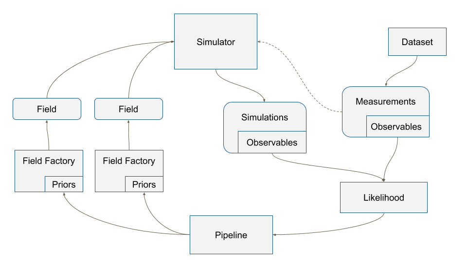

===============
Design overview
===============

Our basic objective is, given some data, to be able to constrain the
parameter space of a model, and/or to compare the plausibility of
different models.  IMAGINE was designed to allow that different
groups working on different models could be to constrain them through
easy access a range of datasets and the required statistical machinery.
Likewise, observers can quickly check the consequences and interpret
their new data by seeing the impact on different models and toy models.

In order to be able to do this systematically and rigorously, the basic
design of IMAGINE first breaks the problem into two abstractions:
`Fields`_, which represent models of physical fields, and
`Observables`_, which represent
both observational or mock data.

New observational data are included in IMAGINE using the `Datasets`_,
which help effortlessly adjusting the format of the data to the standard
specifications (and are internally easily converted into *Observables*)
Also, a collection of *Datasets* contributed by the community can be found in
the Consortium's dedicated `Dataset repository <https://github.com/IMAGINE-Consortium/imagine-datasets>`_.

The connection between a theory and reality done by one of the `Simulators`_.
Each of these corresponds to a mapping from a set of model *Fields* into a mock
*Observables*. The available simulators, importantly,
include `Hammurabi <https://bitbucket.org/hammurabicode/hamx/wiki/Home>`_,
which can compute Faraday rotation measure and diffuse synchrotron and thermal
dust emission.

Each of these `IMAGINE Components`_ (Fields, Observables, Datasets, Simulators)
are represented by a Python class in IMAGINE.
Therefore, in order to use extend IMAGINE with a specific new field or
including a new observational dataset, one needs to create a *subclass* of
one of IMAGINE's base classes. This subclass will, very often, be
a `wrapper <https://en.wikipedia.org/wiki/Wrapper_function>`_ around
already existing code or scripts. To preserve the modularity and
flexibility of IMAGINE, one should try to use
(`as far as possible <Disclaimer>`_) only the provided base classes.

    The structure of the IMAGINE pipeline.

:numref:`IMAGINE` describes the typical workflow of IMAGINE and introduces other key base classes.
Mock and measured data, in the form of `Observables`_, are used
to compute a likelihood through a `Likelihood`_ class. This, supplemented by a
`Prior`_, allows a `Pipeline`_ object to sample the parameter space and compute
posterior distributions and Baysian evidences for the models. The generation
of different realisations of each Field is managed by the corresponding
`Field Factory`_ class. Likewise, `Observable Dictionaries`_ help one
organising and manipulating *Observables*.

==================
IMAGINE Components
==================

In the following sections we describe each of the basic components of IMAGINE
and demonstrate how to use templates to write wrappers allow the inclusion of
pre-existing code.

------
Fields
------

.. _Field Factory:

The *Field factory*

^^^^
Grid
^^^^

^^^^^^^^^^^^^^^^^
Thermal electrons
^^^^^^^^^^^^^^^^^

A new model for the distribution of thermal electrons can be introduced
subclassing :py:class:`imagine.fields.basic_fields.ThermalElectronDensityField`
according to the template below.

.. literalinclude:: ../../imagine/templates/thermal_electrons_template.py

Note that the return value of the method :py:meth:`get_field` must be of type
:py:class:`astropy.units.Quantity`, with shape consistent with the coordinate
grid, and units of :math:`\rm cm^{-3}`.

^^^^^^^^^^^^^^^
Magnetic Fields
^^^^^^^^^^^^^^^

One can add a new model for magnetic fields subclassing
:py:class:`imagine.fields.basic_fields.MagneticField` as illustrated in the
template below.

.. literalinclude:: ../../imagine/templates/magnetic_field_template.py

The method :py:meth:`get_field` must return an :py:class:`astropy.units.Quantity`,
with shape `(Nx,Ny,Nz,3)` where `Ni` is the corresponding grid resolution and
the last axis corresponds to the component (with x, y and z associated with
indices 0, 1 and 2, respectively). The Quantity returned by the method must
correpond to a magnetic field (i.e. units must be :math:`\mu\rm G`, :math:`\rm G`,
:math:`\rm nT`, or similar).

^^^^^^^^^^^^^^^^^^^^
Cosmic ray electrons
^^^^^^^^^^^^^^^^^^^^

.. .. literalinclude:: ../../imagine/fields/template/cre_density_template.py

--------
Datasets
--------

.. _Observables:

-----------------------------------------
Measurements, Simulations and Covariances
-----------------------------------------

.. _Observable Dictionaries:

----------
Simulators
----------

.. literalinclude:: ../../imagine/templates/simulator_template.py

----------
Likelihood
----------

-----
Prior
-----

--------
Pipeline
--------

-----------
Disclaimer
-----------

Nothing is written in stone and the base classes may be updated with time
(so, always remember to report the `code release <https://github.com/IMAGINE-Consortium/imagine/releases>`_ when you make use of IMAGINE).
Suggestions and improvements are welcome as GitHub `issues <https://github.com/IMAGINE-Consortium/imagine/issues/new>`_ or pull requests
