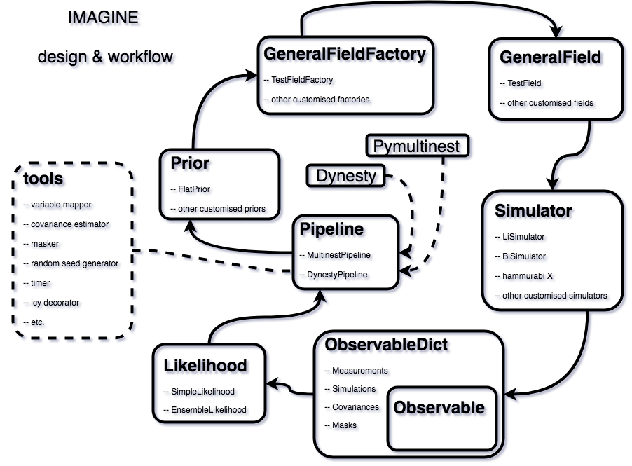

===============
Design overview
===============

Our basic objective is, given some data, to be able to constrain the
parameter space of a model, and/or to compare the plausibility of
different models.  IMAGINE was designed to allow that different
groups working on different models could be to constrain them through
easy access a range of datasets and the required statistical machinery.
Likewise, observers can quickly check the consequences and interpret
their new data by seeing the impact on different models and toy models.

In order to be able to do this systematically and rigorously, the basic
design of IMAGINE first breaks the problem into two abstractions:
`Fields`_, which represent models of physical fields, and
`Observables`_, which represent
both observational or mock data.

New observational data are included in IMAGINE using the `Datasets`_,
which help effortlessly adjusting the format of the data to the standard
specifications (and are internally easily converted into *Observables*)
Also, a collection of *Datasets* contributed by the community can be found in
the Consortium's dedicated `Dataset repository <https://github.com/IMAGINE-Consortium/imagine-datasets>`_.

The connection between a theory and reality done by one of the `Simulators`_.
Each of these corresponds to a mapping from a set of model *Fields* into a mock
*Observables*. The available simulators, importantly,
include `Hammurabi <https://bitbucket.org/hammurabicode/hamx/wiki/Home>`_,
which can compute Faraday rotation measure and diffuse synchrotron and thermal
dust emission.

Each of these `IMAGINE Components`_ (Fields, Observables, Datasets, Simulators)
are represented by a Python class in IMAGINE.
Therefore, in order to use extend IMAGINE with a specific new field or
including a new observational dataset, one needs to create a *subclass* of
one of IMAGINE's base classes. This subclass will, very often, be
a `wrapper <https://en.wikipedia.org/wiki/Wrapper_function>`_ around
already existing code or scripts. To preserve the modularity and
flexibility of IMAGINE, one should try to use
(as far as possible, but see the `Disclaimer`_) only the provided base classes.

    The structure of the IMAGINE pipeline.

:numref:`IMAGINE` describes the typical workflow of IMAGINE and introduces other key base classes.
Mock and measured data, in the form of `Observables`_, are used
to compute a likelihood through a `Likelihood`_ class. This, supplemented by a
`Prior`_, allows a `Pipeline`_ object to sample the parameter space and compute
posterior distributions and Baysian evidences for the models. The generation
of different realisations of each Field is managed by the corresponding
`Field Factory`_ class. Likewise, `Observable Dictionaries`_ help one
organising and manipulating *Observables*.

==================
IMAGINE Components
==================

In the following sections we describe each of the basic components of IMAGINE
and demonstrate how to use templates to write wrappers allow the inclusion of
pre-existing code.

------
Fields
------

In IMAGINE terminology, a **field** refers to any  *computational model* of a
spatially varying physical quantity, such as the Galactic Magnetic Field (GMF),
the thermal electron distribution, or the Cosmic Ray (CR) distribution.
Generally, a field object will have a set of parameters — e.g. a GMF field
object may have a pitch angle, scale radius, amplitude, etc.
*Field* objects are used as inputs by the `Simulators`_, which *simulate*
those physical models, i.e. they allow constructing construct *observables*
based on a set models.

During the sampling, the `Pipeline`_ does not handle fields directly  but
instead relies on `Field Factory`_ objects.
While the *field objects* will do the actual computation of the physical field,
given a set of physical parameters and a coordinate grid,
the *field factory objects* take care of book-keeping tasks: they hold the
parameter ranges and default values, they translate the dimensionless parameters
used by the sampler (always in the interval :math:`[0,1]`) to physical
parameters, they store the `Prior`_ associated with that *field*.

To convert ones own model into a IMAGINE-compatible field, one must create
subclass one of the base classes available the
:py:mod:`imagine.fields.basic_fields`, most likely using one of the available
templates to write a *wrapper* to the original code which are discussed in the
sections below.
If basic field type one is interested is *not* available as a basic field, one can
create it directly subclassing  :py:class:`imagine.fields.field.GeneralField` —
and if you think this could benefit the wider community, please consider
submitting a
`pull request <https://github.com/IMAGINE-Consortium/imagine/pulls>`_ or
openning an `issue <https://github.com/IMAGINE-Consortium/imagine/issues>`_
requesting the inclusion of the new field type!

It is assumed that Field objects can be expressed as a parametrised *mapping of
a coordinate grid into a physical field*. The grid is represented by a IMAGINE `Grid`_ object, discussed in detail in the next section.
The design of any field is done writing a subclass that overrides the method :py:meth:`get_field`, using it to conduct the computation of the field
at each spatial point. For this, the coordinate grid on which the field should be evaluated can be accessed from `self.grid` and the parameters from
`self.parameters`.
The same parameters need to listed as keys in the `field_checklist` dictionary
(the values in the dictionary are used to supply extra information to specific
simulators, but can be left as `None` in the general case).

To test a Field class, :py:class:`FieldFoo`, one can
instantiate the field object::

    bar = FieldFoo(grid=example_grid, parameters={'answer': 42})

where `example_grid` is a previously instantiated grid object.
Assuming we are dealing with a scalar, the radial dependence can be easily
plotted using::

    plt.bar(bar.grid.r_spherical.ravel(), bar.data.ravel())

^^^^
Grid
^^^^

Field objects require (with the exception of `Dummy`_ fields) a coordinate grid
to operate.
In IMAGINE this is expressed as an instance of the
:py:class:`imagine.fields.grid.BaseGrid` class, which represents coordinates as
a set of three 3-dimensional arrays.
The grid object supports cartesian, cylindrical and spherical coordinate systems,
handling any conversions between these automatically through the properties.

The convention is that :math:`0` of the coordinates corresponds to the
Galaxy (or galaxy) centre, with the :math:`z` coordinate giving the distance to
the midplane.

For constructing a grid with uniformly-distributed coordinates one can use the
:py:class:`imagine.fields.grid.UniformGrid` that accompanies IMAGINE.
For example, one can create a grid where the cylindrical coordinates are equally
spaced using::

    cylindrical_grid = img.UniformGrid(box=[[0.25*u.kpc, 15*u.kpc],
                                            [-180*u.deg, np.pi*u.rad],
                                            [-15*u.kpc, 15*u.kpc]],
                          resolution = [9,12,9],
                          grid_type = 'cylindrical')

The :py:data:`box` argument contains the lower and upper limits of the
coordinates (respectively :math:`r`, :math:`\phi` and :math:`z`,
:py:data:`resolution` specifies the number of points for each dimension, and
:py:data:`grid_type` chooses this to be cylindrical coordinates.

The coordinate grid can be accessed through the properties
:py:data:`cylindrical_grid.x`,
:py:data:`cylindrical_grid.y`,
:py:data:`cylindrical_grid.z`,
:py:data:`cylindrical_grid.r_cylindrical`,
:py:data:`cylindrical_grid.r_spherical`,
:py:data:`cylindrical_grid.theta` (polar angle), and
:py:data:`cylindrical_grid.phi` (azimuthal angle),
with conversions handled automatically.
Thus, if one wants to access, for instance, the corresponding :math:`x`
cartesian coordinate values, this can be done simply using::

    cylindrical_grid.x[:,:,:]

To create a personalised (non-uniform) grid, one needs to subclass
:py:class:`imagine.fields.grid.BaseGrid` and override the method :py:meth:`generate_coordinates`. The :py:class:`imagine.fields.grid.UniformGrid`
class should itself provide a good example/template of how to do this.

^^^^^^^^^^^^^^^^^
Thermal electrons
^^^^^^^^^^^^^^^^^

A new model for the distribution of thermal electrons can be introduced
subclassing :py:class:`imagine.fields.basic_fields.ThermalElectronDensityField`
according to the template below.

.. literalinclude:: ../../imagine/templates/thermal_electrons_template.py

Note that the return value of the method :py:meth:`get_field` must be of type
:py:class:`astropy.units.Quantity`, with shape consistent with the coordinate
grid, and units of :math:`\rm cm^{-3}`.

The template assumes that one already possesses a model for distribution of
thermal :math:`e^-` in a module :py:mod:`MY_GALAXY_MODEL`. Such model needs to
be able to map an arbitrary coordinate grid into a densities.

Of course, one can also write ones model (if it is simple enough) into the
derived subclass definition. On example of a class derived from
:py:class:`imagine.fields.basic_fields.ThermalElectronDensityField` can be seen
bellow::

    from imagine import ThermalElectronDensityField

    class ExponentialThermalElectrons(ThermalElectronDensityField):
        """Example: thermal electron density of an (double) exponential disc"""

        field_name = 'exponential_disc_thermal_electrons'

        @property
        def field_checklist(self):
            return {'central_density' : None, 'scale_radius' : None, 'scale_height' : None}

        def get_field(self):
            R = self.grid.r_cylindrical
            z = self.grid.z
            Re = self.parameters['scale_radius']
            he = self.parameters['scale_height']
            n0 = self.parameters['central_density']

            return n0*np.exp(-R/Re)*np.exp(-np.abs(z/he))

^^^^^^^^^^^^^^^
Magnetic Fields
^^^^^^^^^^^^^^^

One can add a new model for magnetic fields subclassing
:py:class:`imagine.fields.basic_fields.MagneticField` as illustrated in the
template below.

.. literalinclude:: ../../imagine/templates/magnetic_field_template.py

It was assumed the existence of a hypothetical module :py:mod:`MY_GALAXY_MODEL`
which, given a set of parameters and 3 arrays containing coordinate values,
computes the magnetic field vector at each point.

The method :py:meth:`get_field` must return an :py:class:`astropy.units.Quantity`,
with shape `(Nx,Ny,Nz,3)` where `Ni` is the corresponding grid resolution and
the last axis corresponds to the component (with x, y and z associated with
indices 0, 1 and 2, respectively). The Quantity returned by the method must
correpond to a magnetic field (i.e. units must be :math:`\mu\rm G`, :math:`\rm G`,
:math:`\rm nT`, or similar).

A simple example, comprising a constant magnetic field can be seen below::

    from imagine import MagneticField

    class ConstantMagneticField(MagneticField):
        """Example: constant magnetic field"""
        field_name = 'constantB'

        @property
        def field_checklist(self):
            return {'Bx': None, 'By': None, 'Bz': None}

        def get_field(self):
            # Creates an empty array to store the result
            B = np.empty(self.data_shape) * self.parameters['Bx'].unit
            # For a magnetic field, the output must be of shape:
            # (Nx,Ny,Nz,Nc) where Nc is the index of the component.
            # Computes Bx
            B[:,:,:,0] = self.parameters['Bx']*np.ones(self.grid.shape)
            # Computes By
            B[:,:,:,1] = self.parameters['By']*np.ones(self.grid.shape)
            # Computes Bz
            B[:,:,:,2] = self.parameters['Bz']*np.ones(self.grid.shape)
            return B

^^^^^^^^^^^^^^^^^^^^
Cosmic ray electrons
^^^^^^^^^^^^^^^^^^^^

*Under development*

.. .. literalinclude:: ../../imagine/templates/cre_density_template.py

^^^^^
Dummy
^^^^^

.. literalinclude:: ../../imagine/templates/dummy_field_template.py

^^^^^^^^^^^^^^^^^^^^
Field Factory
^^^^^^^^^^^^^^^^^^^^

Field Factories are an additional layer of infrastructure used by the samplers
to provide the connection between the sampling of points in the likelihood space
and the field object that will be given to the simulator.

A *Field Factory* object has a list of all of the field’s parameters and also a
list of the subset of those that are to be varied in the sampler
— the active parameters.
It also holds the allowed value ranges for each varied parameter as well as
default values which are used for inactive parameters. At each step the
`Pipeline`_ it asks the field factory for the next point in parameter space,
and the factory gives it one in the form of a  field object that can be handed
to the simulator, which in turn provides simulated observables for comparison
with the measured observables in the likelihood module.

.. literalinclude:: ../../imagine/templates/field_factory_template.py

--------
Datasets
--------

.. _Observables:

-----------------------------------------
Measurements, Simulations and Covariances
-----------------------------------------

.. _Observable Dictionaries:

----------
Simulators
----------

.. literalinclude:: ../../imagine/templates/simulator_template.py

----------
Likelihood
----------

-----
Prior
-----

--------
Pipeline
--------

-----------
Disclaimer
-----------

Nothing is written in stone and the base classes may be updated with time
(so, always remember to report the `code release <https://github.com/IMAGINE-Consortium/imagine/releases>`_ when you make use of IMAGINE).
Suggestions and improvements are welcome as GitHub `issues <https://github.com/IMAGINE-Consortium/imagine/issues/new>`_ or pull requests
