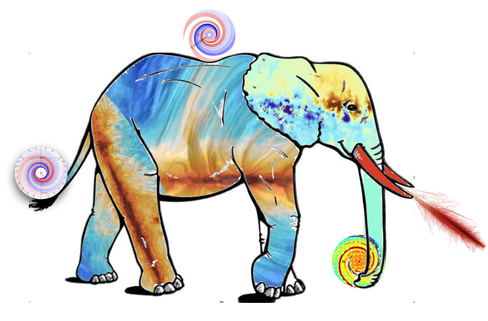

.. IMAGINE documentation master file, created by
   sphinx-quickstart on Wed Nov  6 13:05:25 2019.
   You can adapt this file completely to your liking, but it should at least
   contain the root `toctree` directive.

IMAGINE: Interstellar MAGnetic field INference Engine
======================================================

Welcome to the documentation of the
`IMAGINE software package <https://github.com/IMAGINE-Consortium/imagine/>`_,
a publicly available Bayesian platform that allows
using a variety of observational data sets to constrain models for
the main ingredients of the interstellar medium of the Galaxy.
IMAGINE calculates simulated data sets from the galaxy models and compares these to
the observational data sets through a likelihood evaluation.
It then samples this multi-dimensional likelihood space, which allows one to
update prior knowledge, and thus to find the position with the
:ref:`best-fit model <posterior>` parameters and/or compute the
:ref:`model evidence <evidence>` (which enables rigorous comparison of competing
models).

IMAGINE is developed and maintained by the
`IMAGINE consortium <https://www.astro.ru.nl/imagine/>`_,
a diverse group of researchers whose common interest revolves
around developing an integrated understanding of the various components of the
Galactic interstellar medium (with emphasis on the Galactic magnetic field and
its interaction with cosmic rays). For more details on IMAGINE science case,
please refer to the
`IMAGINE whitepaper <https://doi.org/10.1088/1475-7516/2018/08/049>`_.

.. toctree::
   :maxdepth: 2
   :caption: Contents:

   installation
   design
   components
   posterior
   evidence
   parallel

.. toctree::
   :maxdepth: 1
   :caption: Tutorials:

   tutorial_one
   tutorial_datasets
   tutorial_fields
   tutorial_simulator
   tutorial_hammurabi
   tutorial_priors

.. toctree::
    :maxdepth: 4
    :caption: API Reference

    imagine

Indices and tables
==================

* :ref:`genindex`
* :ref:`modindex`
* :ref:`search`
