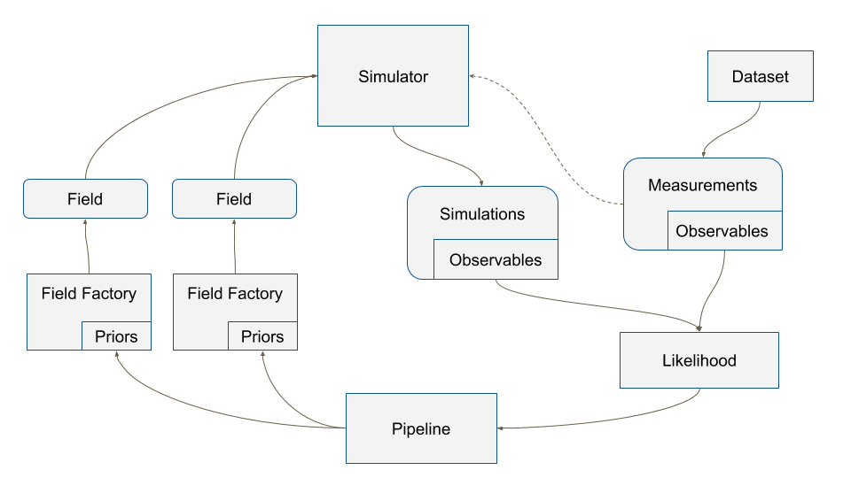

===============
Design overview
===============

Our basic objective is, given some data, to be able to constrain the
parameter space of a model, and/or to compare the plausibility of
different models.  IMAGINE was designed to allow that different
groups working on different models could be to constrain them through
easy access a range of datasets and the required statistical machinery.
Likewise, observers can quickly check the consequences and interpret
their new data by seeing the impact on different models and toy models.

In order to be able to do this systematically and rigorously, the basic
design of IMAGINE first breaks the problem into two abstractions:
:ref:`Fields`, which represent models of physical fields, and
:ref:`Observables <Observables>`, which represent
both observational and mock data.

New observational data are included in IMAGINE using the :ref:`Datasets`,
which help effortlessly adjusting the format of the data to the standard
specifications (and are internally easily converted into :ref:`Observables <Observables>`)
Also, a collection of *Datasets* contributed by the community can be found in
the Consortium's dedicated `Dataset repository <https://github.com/IMAGINE-Consortium/imagine-datasets>`_.

The connection between a theory and reality is done by one of the :ref:`Simulators`.
Each of these corresponds to a mapping from a set of model *Fields* into a mock
*Observables*. The available simulators, importantly,
include `Hammurabi <https://bitbucket.org/hammurabicode/hamx/wiki/Home>`_,
which can compute Faraday rotation measure and diffuse synchrotron and thermal
dust emission.

Each of these :ref:`IMAGINE Components` (:ref:`Fields`,
:ref:`Observables <Observables>`, :ref:`Datasets`, :ref:`Simulators`)
are represented by a Python class in IMAGINE.
Therefore, in order to extend IMAGINE with a specific new field or
including a new observational dataset, one needs to create a *subclass* of
one of IMAGINE's base classes. This subclass will, very often, be
a `wrapper <https://en.wikipedia.org/wiki/Wrapper_function>`_ around
already existing code or scripts. To preserve the modularity and
flexibility of IMAGINE, one should try to use
(:ref:`as far as possible <Disclaimer>`) only the provided base classes.

    The structure of the IMAGINE pipeline.

:numref:`IMAGINE` describes the typical workflow of IMAGINE and introduces other key base classes.
Mock and measured data, in the form of :ref:`Observables <Observables>`, are used
to compute a likelihood through a :ref:`Likelihood` class. This, supplemented by
:ref:`Priors`, allows a :ref:`Pipeline` object to sample the parameter space and compute
posterior distributions and  Bayesian evidences for the models. The generation
of different realisations of each Field is managed by the corresponding
:ref:`Field Factory` class. Likewise, :ref:`Observable Dictionaries <ObservableDictionaries>` help one
organising and manipulating *Observables*.

